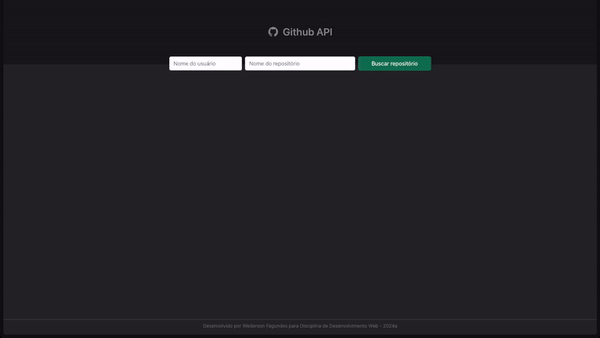

# Projeto2a: GitHub API e DOM Manipulation

#### Daploy
> https://elc1090.github.io/project2a-2024a-wederson/

#### Desenvolvedor
Wederson Machado Fagundes

#### Ambiente de desenvolvimento
- Visual Studio Code
- Live server

#### Créditos
- [Github REST API Documentation](https://docs.github.com/en/rest?apiVersion=2022-11-28)
- [Tailwind CSS](https://tailwindcss.com/)

#### Bastidores
Trabalho foi realizado individualmente. Inicialmente, após ler os requisitos do trabalho, busquei busquei entender, na documentação, o que era possível ser retornado pela API. Após isso busquei por referências de design para realizar a construção do layout.
Fiz a construção da interface utilizando o Tailwind CSS, e foquei na melhoria do código JavaScript realizar a chamada na API e também adicionei alguns recursos como, validação se algo foi preenchido, limpar os campos de busca após a busca e remover itens anteriores da tela ao realizar uma nova busca, além de ajustar para dispositivos móveis. 

---
Projeto entregue para a disciplina de [Desenvolvimento de Software para a Web](http://github.com/andreainfufsm/elc1090-2024a) em 2024a